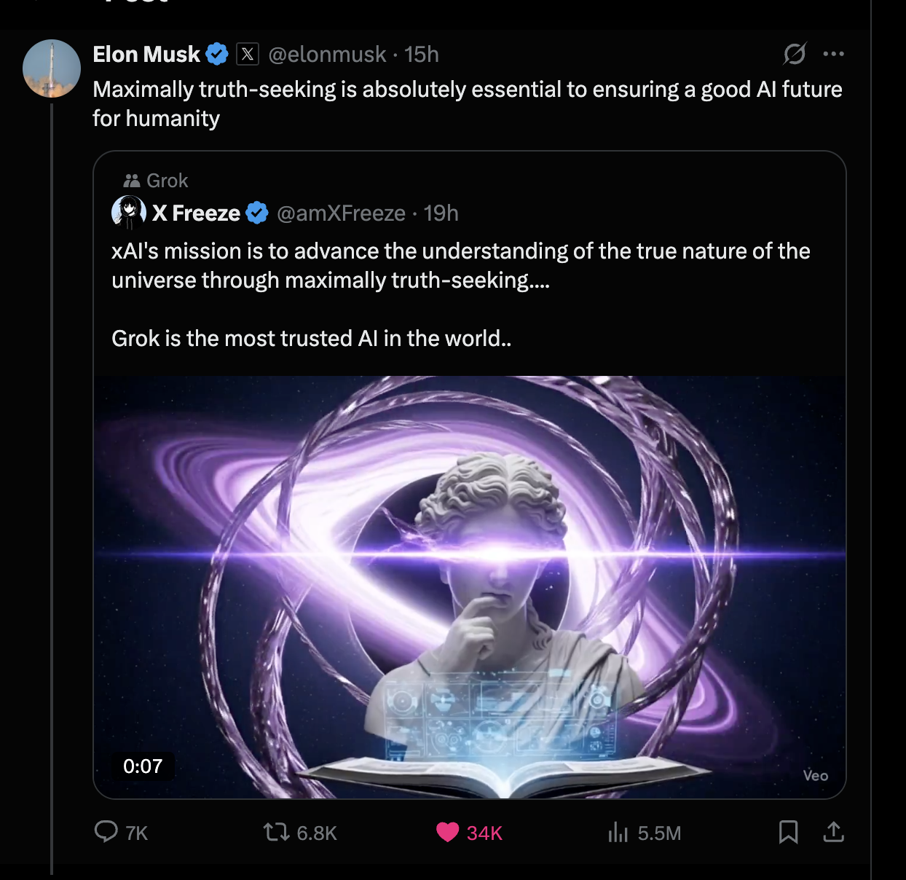

TBH I have wanted to build this AI for a while and likley have some notes to show this idea a long time ago ...have not had time.. and when I read this X post from Elon i figured it was perfect time when Grok4 told me it was not already done. I am a Gospel teacher at heart and have tried to codify all Gospel principles and use gospel mapping and codify them into subgoiurps like financial or social ..etc see this `logs/thoughts7-25.jpeg.png` --> Russel M Nelson pioneered some heart surgey stuff and wrote about how there are laws to every kingdom of science so to speak . (see DC, power is in us book) - I did some study on what are the laws of AI - quantify and compute and all this i can find notes later 

I also wanted to mention I am making a cool project for predicting innovartion in a way never done before... more later on this and this sort of overlaps with my mission there. Also Elon i heard said that Grok 4 next year likely can start to drive innovation in NEW physics and this all ties into some curiousness i have. 

the title of my father's auto biography is My Quest for truth and he considered hiumself a truth seeker as his life mission ... any how that is part of my upbringing to note this aspect .. found useful to mention not that important just bio notes grew up around him talking of this all day everyday

context Jul 24 2025 

No, there is no publicly documented or widely recognized algorithm specifically designed for AI to base all its decisions exclusively on the two great commandments of the gospel (loving God with all your heart, soul, and mind, and loving your neighbor as yourself, as described in Matthew 22:36-40). However, there are related concepts, AI systems, and ongoing discussions in Christian ethics that draw on these principles to guide AI development and use.

For context, AI decision-making typically relies on frameworks like reinforcement learning, neural networks, or rule-based systems, which are trained on data to optimize for goals such as efficiency, accuracy, or ethical constraints. Aligning AI with religious principles like the two commandments would require defining them in computable terms (e.g., maximizing "love" as actions that promote well-being without harm, while prioritizing devotion to a divine entity), but this introduces challenges like interpreting abstract concepts algorithmically, avoiding biases, and handling conflicts (e.g., what if "loving neighbor" clashes with "loving God" in a scenario?).

From extensive searches across web sources and X (formerly Twitter):
- No exact match for such an algorithm exists in academic papers, open-source projects, or commercial AI tools. Searches for terms like "AI algorithm based on two great commandments" or "AI decision making Christian love God neighbor" yielded discussions on ethical AI from a Christian perspective, but not a dedicated algorithm.
- Closest examples include experimental AIs like "AI Jesus" (an AI trained on biblical texts to respond as if it were Jesus, often emphasizing love, grace, and the greatest commandments in its answers). It provides spiritual guidance on Twitch, summarizing the Bible around these laws and handling queries with humility, but it's not a general decision-making algorithm—it's more of a conversational tool, and its responses aren't strictly limited to or enforced by those two laws alone.
- Broader Christian AI ethics efforts focus on humans using or designing AI to align with these commandments (e.g., ensuring AI promotes human dignity, justice, and neighborly love, while avoiding idolatry like over-relying on technology instead of God). For instance:
  - Resources from organizations like AI and Faith discuss integrating biblical values into AI to "love God and neighbor," but this is about guiding human developers, not an AI algorithm itself.
  - Sermons, podcasts, and articles (e.g., from Christianity Today or church conferences) urge Christians to evaluate AI through these lenses, such as asking if an AI tool honors God or benefits others, but again, no specific algorithm is proposed or implemented.
- On X, posts touch on AI and scripture (e.g., memes about "God's Chosen Algorithm" or decision grids from 1 Corinthians for ethical choices), but they're conceptual or devotional, not technical algorithms.

If such an algorithm were to be created, it could theoretically use techniques like value alignment in reinforcement learning, where the "reward function" prioritizes outcomes that reflect the commandments (e.g., scoring decisions higher if they demonstrate selflessness or spiritual integrity). But as of now, no evidence of this exists beyond hypothetical ideas in theological-AI intersections.

If you're interested in exploring or building something like this, or if you meant a different interpretation of the question, feel free to provide more details!