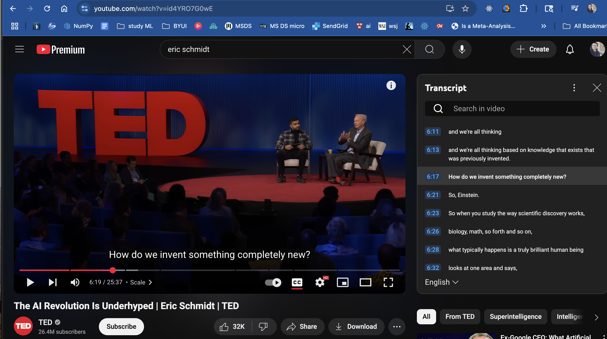

Thoughts on teaching a Ai to process cognitively smartly a certain creative way for innovation and problem solving

habits of the mind - GBH
steve jobs quotes - connection of humanity and science, also law school and programming as models on how to think for all humans 

## well educated mind book 
three levels of understanding. 
taste. basic knowledge
swallow. take knowledge in. to your own understanding - is it true. why. valid
digest. fold into your own understanding.  let it change the way you think. or reject it as unworthy. 

find out facts. evaluate them. form your own opinion 
Here’s a concise framework for the three levels of understanding, followed by a summary of Susan Wise Bauer’s The Well‑Educated Mind:

Three Levels of Understanding
Taste
– What it is: A first encounter—skimming or sampling the outline of an idea.
– Goal: Get the gist. Recognize the topic, scope, and key terms.

Swallow
– What it is: Delving deeper—examining the facts, arguments, and evidence.
– Goal: Ask “Is it true? How do I know?” Validate sources, test logic, compare perspectives.

Digest
– What it is: Internalizing or rejecting—folding the idea into your worldview.
– Goal: Let it reshape your thinking (or discard it if it falls short). Form your own, well‑informed opinion.

## Summary: The Well‑Educated Mind

Susan Wise Bauer’s The Well‑Educated Mind is a guide for adults who want to revive the classical habit of reading “great books” with purpose and skill. Its core lessons:

A Systematic Reading Plan

Genres to cover: History, Biography, Philosophy, Poetry, Fiction, Drama, and Fine Arts.

Why: Each genre trains a different part of the mind—contextual thinking, moral reasoning, emotional intelligence, aesthetic judgment.

Four Stages of Active Reading

Inspectional (Taste): Survey the work—titles, headings, summary—to form a roadmap.

Analytical (Swallow): Break the argument into parts. Identify thesis, evidence, assumptions, and implications.

Interpretive: Ask probing questions—“What does this mean? What’s the author’s purpose?”

Syntopical (Digest): Compare across texts. Weave together multiple viewpoints into a synthesized, personal understanding.

Tools for Critical Engagement

Annotation: Mark passages, jot questions in margins.

Note‑taking: Summaries, outlines, and concept maps to track structure and your reactions.

Discussion: Talking through ideas with others to test and refine your judgments.

Building Intellectual Habits

Consistency: Short, daily reading sessions keep ideas alive in your mind.

Reflection: Regularly revisit notes and ask how new insights fit (or conflict) with your existing beliefs.

Growth: Over time, you’ll move from merely appreciating great works to contributing your own, well‑reasoned perspectives.

Putting It Together:

Taste = Inspectional Reading

Swallow = Analytical & Interpretive Reading

Digest = Syntopical Reading & Personal Integration

By following Bauer’s roadmap, you learn not just what to read but how to read—so that every book you tackle can transform your mind, one level at a time.

Discover Your Genius by Michael J. Gelb is a guided workbook that helps you unlock your innate creativity by studying the minds of ten history‑making geniuses. Gelb argues that “genius” isn’t an inborn gift reserved for the few but a set of attitudes and practices anyone can cultivate through focused study, self‑assessment, and deliberate exercises (HarperCollins).
The book is structured around ten “genius profiles,” each pairing a brief biography with a targeted self‑reflection and practical exercises. The ten figures and their corresponding insights are:
* Plato — Deepening your love of wisdom
* Filippo Brunelleschi — Expanding your perspective
* Christopher Columbus — Strengthening vision, optimism, and courage
* Nicolaus Copernicus — Reorganizing your worldview
* Queen Elizabeth I — Wielding power with balance and effectiveness
* William Shakespeare — Cultivating emotional intelligence
* Thomas Jefferson — Celebrating freedom in the pursuit of happiness
* Charles Darwin — Honing powers of observation and an open mind
* Mahatma Gandhi — Harmonizing spirit, mind, and body through spiritual genius
* Albert Einstein — Unleashing imagination and “combinatory play” (Barnes & Noble).
Core themes and takeaways:
1. Cultivate Curiosity — Like Plato, foster an insatiable passion for learning.
2. Shift Perspectives — Emulate Brunelleschi’s daring reframing of problems to uncover novel solutions.
3. Vision with Courage — Adopt Columbus’s optimism in charting unexplored territory.
4. Challenge Paradigms — Follow Copernicus in questioning entrenched beliefs and redefining your worldview.
5. Balanced Leadership — Learn from Elizabeth I how to combine authority with diplomacy.
6. Emotional Mastery — Practice Shakespeare’s nuanced understanding of human motivations.
7. Freedom of Thought — Jefferson reminds us that intellectual liberty fuels innovation.
8. Observational Rigor — Darwin’s meticulous attention to detail teaches rigorous inquiry.
9. Integrative Spirit — Gandhi models how inner harmony underpins effective action.
10. Imaginative Play — Einstein shows that playful experimentation ignites breakthroughs (Barnes & Noble).
Through reflective questions, creative “mental play” exercises, and self‑assessments, Gelb provides a clear roadmap for readers to identify which “genius traits” they most need to develop—and how to practice them in daily life. In essence, Discover Your Genius is both a historical tour of revolutionary minds and a hands‑on manual for transforming your own thinking, creativity, and problem‑solving abilities (HarperCollins).

Teaching the AI to think a certain way about problems 

Books like Big design book 
BIG ideas 

Create algorithm  
Studies Michael Murff did about the edge of knowledge  and inspiration 

All problem solving frameworks 

My tech algorithm. 

Elon musk thought -- about how to apply knowldge from one field to another 

Eric Schmidt thought about - where AI needs to advance in the pattern recognizing... he said he was working on.. https://youtu.be/id4YRO7G0wE?si=4MdyOMztPuq0SN8a

2:10
Since then, the gains in what is called reinforcement learning,
2:13
which is what AlphaGo helped invent and so forth,
2:16
allow us to do planning.
2:19
And a good example is look at OpenAI o3
2:23
or DeepSeek R1,
2:25
and you can see how it goes forward and back,
2:28
forward and back, forward and back.
2:30
It's extraordinary.
2:32
In my case, I bought a rocket company
2:34
because it was like, interesting.
2:36
BS: (Laughs) As one does.
2:38
ES: As one does.
2:39
And it’s an area that I’m not an expert in,
2:42
and I want to be an expert.
2:43
So I'm using deep research.
2:45
And these systems are spending 15 minutes writing these deep papers.
2:49
That's true for most of them.
2:51
Do you have any idea how much computation
2:53
15 minutes of these supercomputers is?
2:56
It's extraordinary.
2:57
So you’re seeing the arrival,
2:59
the shift from language to language.
3:01
Tthen you had language to sequence,
3:03
which is how biology is done.
3:05
Now you're doing essentially planning and strategy.
3:09
The eventual state of this
3:11
is the computers running all business processes, right?
3:14
So you have an agent to do this, an agent to do this,
3:17
an agent to do this.
3:19
And you concatenate them together,
3:20
and they speak language among each other.
3:23
They typically speak English language.
Scale
3:26
BS: I mean, speaking of just the sheer compute requirements of these systems,
3:31
let's talk about scale briefly.
3:33
You know, I kind of think of these AI systems as Hungry Hungry Hippos.
3:36
They seemingly soak up all the data and compute that we throw at them.
3:40
They've already digested all the tokens on the public internet,
3:43
and it seems we can't build data centers fast enough.
3:47
What do you think the real limits are,
3:49
and how do we get ahead of them
3:51
before they start throttling AI progress?
3:54
ES: So there's a real limit in energy.
3:56
Give you an example.
3:57
There's one calculation,
3:58
and I testified on this this week in Congress,
4:01
that we need another 90 gigawatts of power in America.
4:06
My answer, by the way, is, think Canada, right?
4:10
Nice people, full of hydroelectric power.
4:12
But that's apparently not the political mood right now.
4:16
Sorry.
4:17
So 90 gigawatts is 90 nuclear power plants in America.
4:22
Not happening.
4:24
We're building zero, right?
4:25
How are we going to get all that power?
4:27
This is a major, major national issue.
4:30
You can use the Arab world,
4:31
which is busy building five to 10 gigawatts of data centers.
4:35
India is considering a 10-gigawatt data center.
4:38
To understand how big gigawatts are,
4:41
is think cities per data center.
4:44
That's how much power these things need.
4:46
And the people look at it and they say,
4:48
“Well, there’s lots of algorithmic improvements,
4:51
and you will need less power."
4:53
There's an old rule, I'm old enough to remember, right?
4:57
Grove giveth, Gates taketh away.
5:00
OK, the hardware just gets faster and faster.
5:03
The physicists are amazing.
5:06
Just incredible what they've been able to do.
5:08
And us software people, we just use it and use it and use it.
5:12
And when you look at planning, at least in today's algorithms,
5:15
it's back and forth and try this and that
5:18
and just watch it yourself.
5:20
There are estimates, and you know this from Andreessen Horowitz reports,
5:24
it's been well studied,
5:26
that there's an increase in at least a factor of 100,
5:29
maybe a factor of 1,000,
5:30
in computation required just to do the kind of planning.
5:34
The technology goes from essentially deep learning to reinforcement learning
5:38
to something called test-time compute,
5:40
where not only are you doing planning,
5:42
but you're also learning while you're doing planning.
5:45
That is the, if you will,
5:46
the zenith or what have you, of computation needs.
5:50
That's problem number one, electricity and hardware.
5:53
Problem number two is we ran out of data
5:57
so we have to start generating it.
5:59
But we can easily do that because that's one of the functions.
6:01
And then the third question that I don't understand
6:04
is what's the limit of knowledge?
6:07
I'll give you an example.
6:08
Let's imagine we are collectively all of the computers in the world,
6:11
and we're all thinking
6:13
and we're all thinking based on knowledge that exists that was previously invented.
6:17
How do we invent something completely new?
6:21
So, Einstein.
6:23
So when you study the way scientific discovery works,
6:26
biology, math, so forth and so on,
6:28
what typically happens is a truly brilliant human being
6:32
looks at one area and says,
6:35
"I see a pattern
6:37
that's in a completely different area,
6:38
has nothing to do with the first one.
6:40
It's the same pattern."
6:42
And they take the tools from one and they apply it to another.
6:45
Today, our systems cannot do that.
6:48
If we can get through that, I'm working on this,
6:51
a general technical term for this is non-stationarity of objectives.
6:56
The rules keep changing.
6:58
We will see if we can solve that problem.
7:00
If we can solve that, we're going to need even more data centers.
7:03
And we'll also be able to invent completely new schools of scientific
7:08
and intellectual thought,
7:10
which will be incredible.
Autonomy
7:11
BS: So as we push towards a zenith,
7:13
autonomy has been a big topic of discussion.
7:16
Yoshua Bengio gave a compelling talk earlier this week,
7:19
advocating that AI labs should halt the development of agentic AI systems
7:23
that are capable of taking autonomous action.
7:25
Yet that is precisely what the next frontier is for all these AI labs,
7:30
and seemingly for yourself, too.
7:32
What is the right decision here?
7:33
ES: So Yoshua is a brilliant inventor of much of what we're talking about
7:38
and a good personal friend.
7:39
And we’ve talked about this, and his concerns are very legitimate.
7:43
The question is not are his concerns right,
7:45
but what are the solutions?
7:47
So let's think about agents.
7:49
So for purposes of argument, everyone in the audience is an agent.
7:53
You have an input that's English or whatever language.
7:56
And you have an output that’s English, and you have memory,
7:59
which is true of all humans.
8:01
Now we're all busy working,
8:02
and all of a sudden, one of you decides
8:06
it's much more efficient not to use human language,
8:09
but we'll invent our own computer language.
8:11
Now you and I are sitting here, watching all of this,
8:14
and we're saying, like, what do we do now?
8:16
The correct answer is unplug you, right?
8:19
Because we're not going to know,
8:22
we're just not going to know what you're up to.
8:25
And you might actually be doing something really bad or really amazing.
8:28
We want to be able to watch.

AI teacher taht responds with way to lead user to Understadning the principle of Einstien to expolain to child most complex thing or you dont; know it understand it well enough 